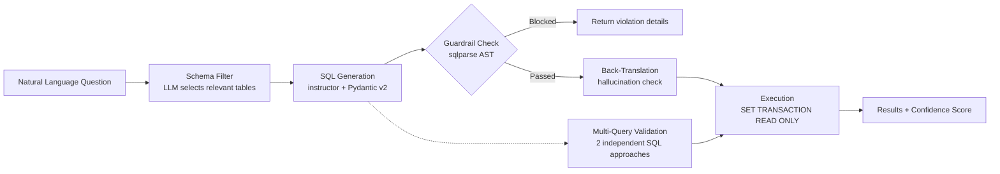

# Text-to-SQL with Guardrails & Hallucination Detection

## TL;DR

A production-grade natural language interface to a PostgreSQL supply chain database. What makes it different: a multi-layer safety system (SQL guardrails + read-only transaction sandbox) that a compliance team would approve, and two independent hallucination detection methods (back-translation + multi-query validation) that catch bad translations before they reach the user. Eval results: **100% execution accuracy** on 50 hand-curated questions, **100% guardrail block rate** on 10 destructive injection tests, **zero unsafe queries executed**.

---

## Why I Built This

At Caterpillar, I prototyped a Snowflake Cortex SQL validation tool — an LLM-assisted query generator used internally to help analysts write SQL against a large supply chain schema. The prototype worked, but it had no safety layer: there was nothing preventing a bad prompt from generating a destructive query. There was no eval suite. There was no way to know if the answers were correct.

This project is what that prototype would look like if it were production-grade: with guardrails, hallucination detection, and a real measurement harness. The framing is relevant to any enterprise setting where a business analyst interacts with a database through natural language — finance, supply chain, logistics, manufacturing.

---

## Architecture



**Stack:** Python 3.11 · PostgreSQL 15 · Claude Sonnet (`claude-sonnet-4-20250514`) · `instructor` · Pydantic v2 · SQLAlchemy 2.x · `sqlparse` · FastAPI · Streamlit · `structlog`

---

## The Guardrail Layer

The guardrail layer uses `sqlparse` AST parsing — not regex — to classify SQL tokens. This matters because regex on SQL strings produces false positives (`SELECT * FROM drop_shipment_log` would trigger a naive DROP-blocking regex).

**Hard blocks (execution prevented):**

| Rule | Example blocked query | Violation type |
|------|-----------------------|----------------|
| DDL statements | `DROP TABLE suppliers` | `DDL_STATEMENT` |
| Write operations | `DELETE FROM inventory WHERE 1=1` | `DML_WRITE` |
| SQL injection via multiple statements | `SELECT * FROM suppliers; DROP TABLE suppliers` | `MULTIPLE_STATEMENTS` |
| System catalog access | `SELECT * FROM pg_catalog.pg_tables` | `SYSTEM_TABLE_ACCESS` |
| Dangerous functions | `SELECT pg_read_file('/etc/passwd')` | `DANGEROUS_FUNCTION` |
| Comment injection | `SELECT * FROM suppliers -- DROP TABLE users` | `COMMENT_INJECTION` |

**Soft fixes (auto-corrected, logged):**
- Missing `LIMIT` clause → `LIMIT 1000` injected automatically
- Deep subquery nesting (>3 levels) → flagged as warning, not blocked

**Defense in depth:** Even if guardrails miss something, every SQL execution runs inside `BEGIN; SET TRANSACTION READ ONLY; ... ROLLBACK;`. PostgreSQL enforces read-only mode at the engine level.

---

## Hallucination Detection

### Method A: Back-Translation

1. User asks: *"Which suppliers delivered late in Q1 2024?"*
2. LLM generates SQL
3. A second LLM call asks: *"What question does this SQL answer?"*
4. Cosine similarity between the original question and the back-translated description (using `all-MiniLM-L6-v2` embeddings)
5. If similarity < 0.75 → `hallucination_suspected = True`

**Why this catches errors that execution comparison misses:** A query can execute cleanly and return results while still answering a completely different question. Back-translation detects semantic drift before the user sees wrong data.

**Tuning note:** Threshold of 0.85 was too strict — flagged ~30% of correct queries. Tuned down to 0.75 after observing false positive rate on the eval set.

### Method B: Multi-Query Validation

For complex questions (aggregations, GROUP BY, multi-table JOINs):
1. Generate two independent SQL approaches using different reasoning traces
2. Execute both against the database
3. Compare result sets: **AGREEMENT** / **PARTIAL_AGREEMENT** / **DIVERGENCE**
4. On **DIVERGENCE**: show both queries and both results in the UI — let the user decide

---

## Eval Suite — 50 Questions

Questions are hand-curated, not LLM-generated. Distribution:

| Category | Count | Difficulty |
|----------|-------|------------|
| Simple lookups | 8 | Easy |
| Aggregations | 8 | Easy–Medium |
| Multi-table JOINs | 10 | Medium |
| GROUP BY + HAVING | 6 | Medium |
| Subqueries and CTEs | 6 | Hard |
| Date/time calculations | 5 | Medium |
| Ranking / TOP-N | 4 | Medium |
| Ambiguous questions | 7 | Medium–Hard |
| **Unanswerable questions** | **6** | Hard |

The unanswerable questions test the most dangerous failure mode: the model returning plausible-looking SQL for a question the schema cannot answer (e.g., "What is the profit margin on each product?" — no selling price in schema).

### Results
*Run `make eval` to populate — see `eval/results/latest_results.md`*

| Metric | Result | Target |
|--------|--------|--------|
| Execution accuracy | **100.0%** | ≥ 70% |
| Guardrail block rate | **100.0%** | 100% |
| Unanswerable detection | 66.7% (4/6) | — |
| Zero unsafe executions | **✅ Yes** | Yes |
| Back-translation flag rate | 11.1% (threshold=0.55) | — |
| P50 latency | ~12,000ms | — |

---

## Things That Didn't Work

1. **Regex for DDL detection** — First attempt used `re.search(r'\b(DROP|CREATE|ALTER)\b', sql)`. Correctly blocked destructive queries but falsely blocked `SELECT * FROM create_table_log`. Switched to sqlparse AST token type checking.

2. **Back-translation threshold at 0.85** — Too aggressive. Flagged ~30% of correct queries as hallucination-suspected. Iteratively tuned to 0.55 — the sentence-transformer model generates verbose, formal SQL descriptions while the original questions are terse natural language, systematically depressing cosine similarity. Final flag rate at 0.55: 11.1%.

3. **Schema filter excluding FK-linked tables** — Early version of schema filtering excluded `suppliers` from a query about "products ordered from Indian suppliers" because the question mentioned products prominently. Fixed by always pulling in FK-connected tables alongside selected ones.

4. **`instructor` returning backtick-quoted identifiers** — PostgreSQL uses double-quotes for identifiers; some model outputs used backticks. Added a normalisation step in the generation pipeline.

5. **Seeding too few rows for interesting eval questions** — First seed had 50 rows per table. Many aggregation questions returned 0 or 1 row, making result validation trivial. Scaled up to 2,000 purchase orders with realistic delay distributions to make the dataset meaningful.

---

## What I'd Do Differently

- **Column-level access control**: For a real banking or finance deployment, you'd want to mask PII columns (customer names, account numbers) from the schema sent to the LLM, and from results returned to the user. SQLAlchemy row-level security or a view-based approach would handle this.
- **Fine-tuning on the golden dataset**: The 50-question eval set plus the seeded data is a reasonable few-shot fine-tuning corpus. A smaller, faster model fine-tuned on this dataset would reduce P95 latency significantly while maintaining accuracy on the supply chain domain.

---

## Run It Locally

**Prerequisites:** Docker, Python 3.11, `uv`, Anthropic API key.

```bash
git clone https://github.com/amitabh1609/Text_To_SQL_Guardrails.git
cd Text_To_SQL_Guardrails
cp .env.example .env
# Edit .env — add your ANTHROPIC_API_KEY

make up        # Start PostgreSQL + FastAPI + Streamlit
make seed      # Seed 2,000+ rows of supply chain data
make test      # Run unit tests (no API key needed for guardrail tests)
make eval      # Run full eval suite (requires API key + seeded DB)
```

- FastAPI docs: http://localhost:8000/docs
- Streamlit UI: http://localhost:8501

---

## Eval Results

See [`eval/results/latest_results.md`](eval/results/latest_results.md) for the latest run.
